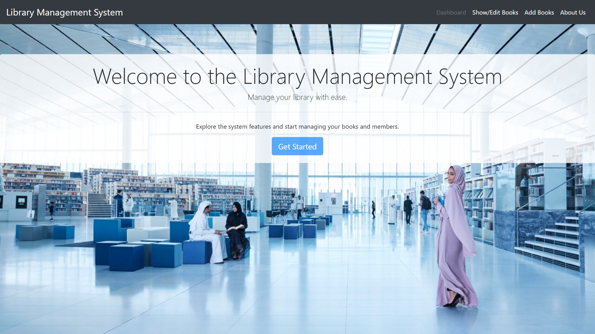
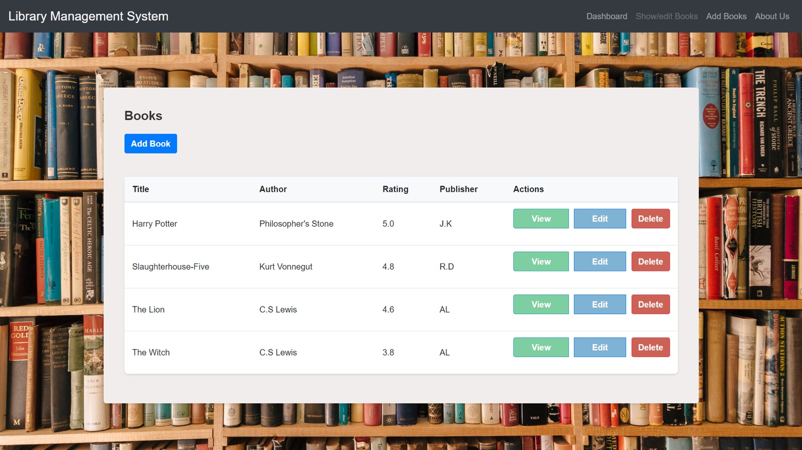
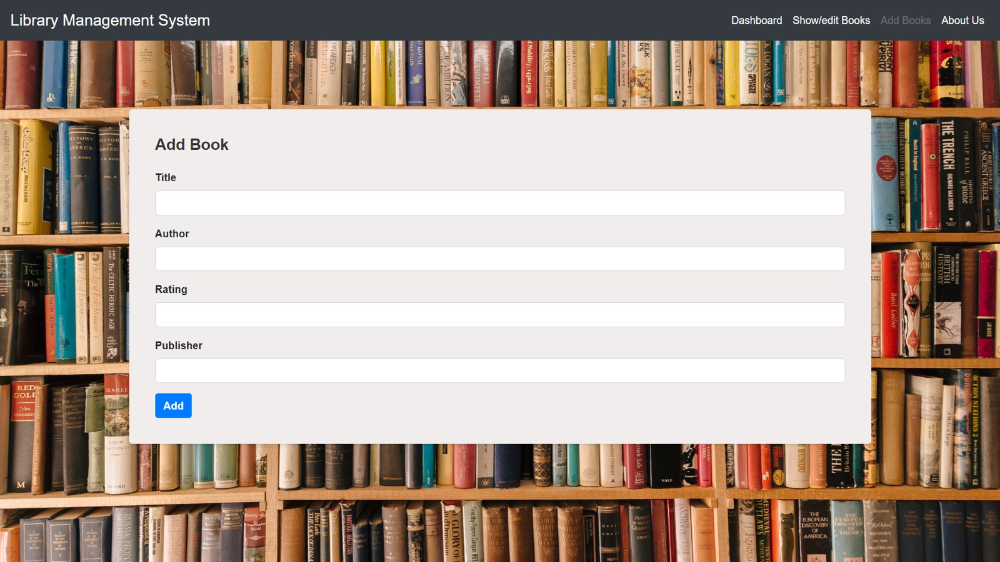
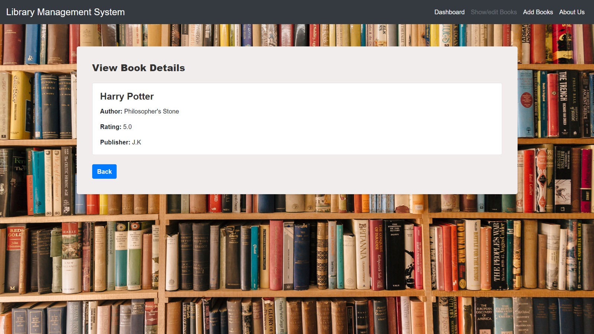
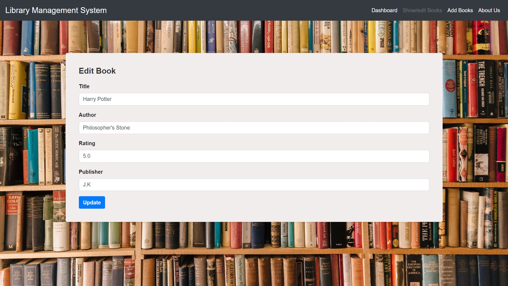
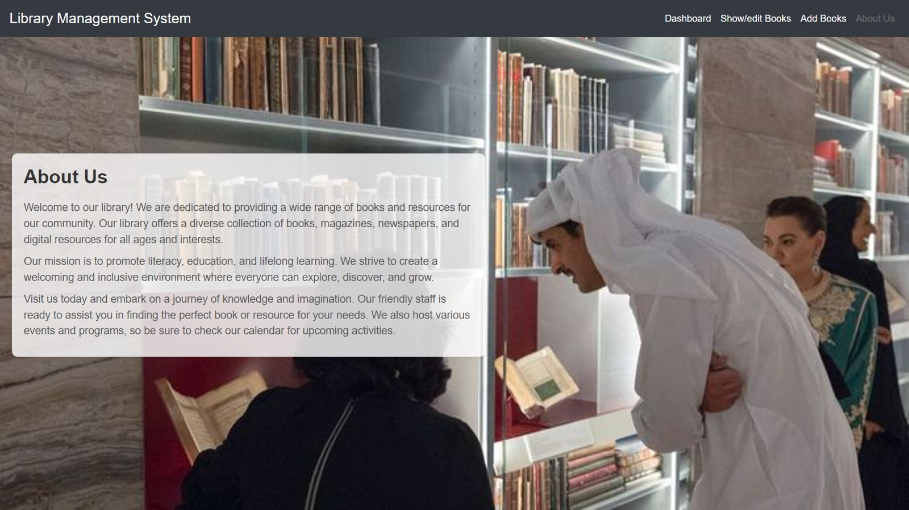

# Library Management System

A Laravel web app for cataloguing a library's collection. Add books, browse
them, edit and delete — each record holding a title, author, rating and
publisher.

Built as a university web programming project.



## Run it

Needs PHP 8.0.2+ and Composer. On macOS:

```bash
brew install php@8.2 composer
```

Then one command does the rest — dependencies, database, sample books and the
server:

```bash
git clone https://github.com/thehmzr/-Librarry.git && cd -Librarry
./run.sh
```

Open http://127.0.0.1:8000. Press Ctrl+C to stop.

It uses SQLite, so there is no database server to install or start. The script
is safe to re-run: it only does the steps that are still needed, and it will not
overwrite books you have added.

```bash
./run.sh --port 8080   # serve on a different port
./run.sh --fresh       # rebuild the database from scratch
./run.sh --setup       # set up without starting the server
```

### Using MySQL instead

The project was originally written against MySQL. To use it, create the
database:

```sql
CREATE DATABASE librarydb;
```

Point `.env` at it:

```
DB_CONNECTION=mysql
DB_HOST=127.0.0.1
DB_PORT=3306
DB_DATABASE=librarydb
DB_USERNAME=root
DB_PASSWORD=
```

Then `php artisan migrate` and `php artisan serve`.

## Pages

**Books.** The full catalogue in one table — title, author, rating and
publisher, with view, edit and delete on every row.



**Add.** A form for the four fields. Submits to `POST /books` and returns to
the catalogue with a confirmation.



**View.** A single book on its own page.



**Edit.** The same four fields, pre-filled from the record, submitted as a
`PUT` to `/books/{id}`.



**About.** A static page describing the library.



## Routes

All book routes come from a single `Route::resource` in `routes/web.php`.

| Method    | URI                | Action                |
| --------- | ------------------ | --------------------- |
| GET       | `/`                | Dashboard             |
| GET       | `/books`           | List all books        |
| GET       | `/books/create`    | Form to add a book    |
| POST      | `/books`           | Store a new book      |
| GET       | `/books/{id}`      | View one book         |
| GET       | `/books/{id}/edit` | Form to edit a book   |
| PUT/PATCH | `/books/{id}`      | Update a book         |
| DELETE    | `/books/{id}`      | Delete a book         |
| GET       | `/about`           | About page            |
| GET       | `/help`            | Help page             |

## Schema

One table, `books`, created by
`database/migrations/2023_05_25_080940_create_books_table.php`.

| Column       | Type      | Notes            |
| ------------ | --------- | ---------------- |
| `id`         | bigint    | primary key      |
| `title`      | string    |                  |
| `author`     | string    |                  |
| `rating`     | string    |                  |
| `publish`    | string    | publisher name   |
| `created_at` | timestamp |                  |
| `updated_at` | timestamp |                  |

## Layout

| Path                                     | What it is                          |
| ---------------------------------------- | ----------------------------------- |
| `app/Http/Controllers/BookController.php` | All seven CRUD actions plus `home()` |
| `app/Models/Book.php`                    | Eloquent model for `books`          |
| `routes/web.php`                         | Route definitions                   |
| `resources/views/books/index.blade.php`  | Catalogue table                     |
| `resources/views/books/create.blade.php` | Add form                            |
| `resources/views/books/edit.blade.php`   | Edit form                           |
| `resources/views/books/show.blade.php`   | Single book page                    |
| `resources/views/books/home.blade.php`   | Dashboard                           |
| `resources/views/about.blade.php`        | About page                          |
| `resources/views/help.blade.php`         | Help page                           |
| `database/migrations/`                   | Schema migrations                   |
| `database/seeders/BookSeeder.php`        | Sample books for a fresh install    |
| `public/`                                | Front controller and images         |
| `config/`                                | Laravel configuration               |
| `run.sh`                                 | One-command setup and server        |

Each view is a standalone page carrying its own markup and styles. Styling is
Bootstrap over CDN, written inline. There is no build step for the front end —
the Vite setup is Laravel's default and unused.

## Notes

`vendor/` and `.env` are not tracked. Run `composer install` and copy
`.env.example` after cloning.

`librarry.zip` and `Library Management System.pptx` are the original
submission archive and its presentation, kept for reference.
